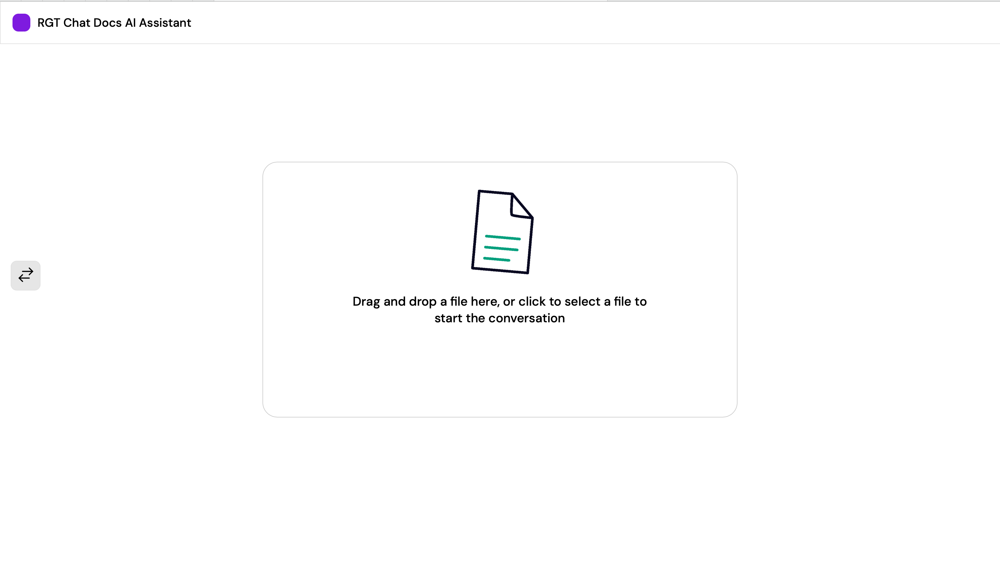
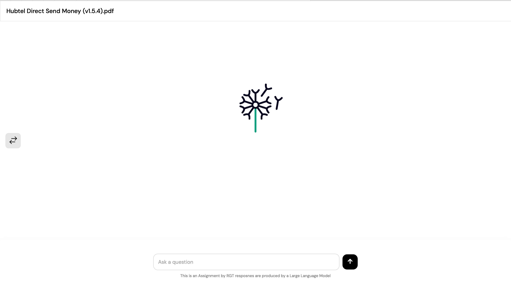
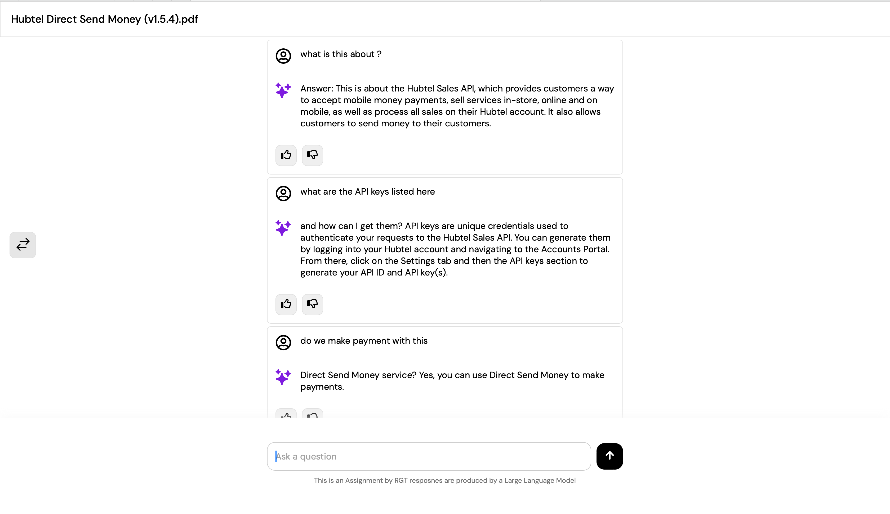
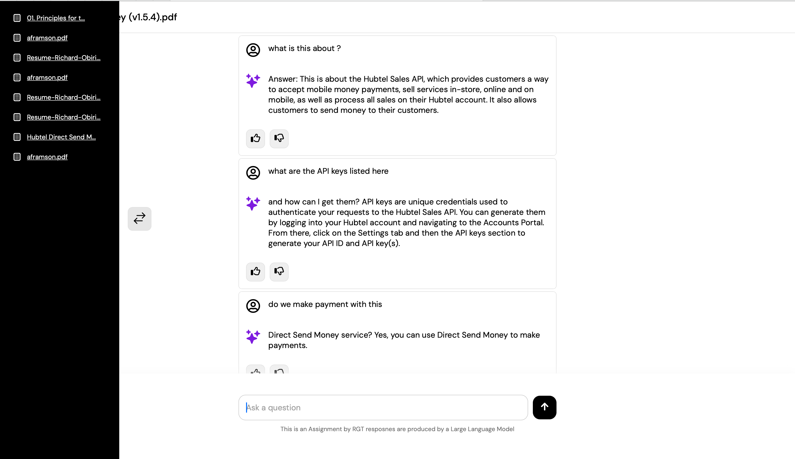

# RGT AI LLM  - DOCUMENT CHAT ASSIGNMENT









# Description

Base on the requirements This project is a full-stack web application that leverages FastAPI, LangChain with OpenAI models for natural language processing, and a responsive front-end built with Next.js. It's designed to process and understand content from various document formats and interact with users through an AI-powered conversational interface.

# Features

* **Document Processing**: Supports uploading and processing of PDF, CSV, and text files.
* **AI-Powered Conversations**: Utilizes LangChain with OpenAI models to answer questions based on the content of uploaded documents.
* **Interactive Front-End**: Built with Next.js, offering a user-friendly interface for file uploads and real-time AI interactions


# Folder Structure

### Backend

* **Config**: contains all configurations including hyperparameters for model tuninig and File locations
* **PromptTemplate**: contains the prompt instruction used to guid the model on what exactly it should perform
* **Utils**: contains functions for processing data
* .**env**: contains environment variables
* **main.py**: contains the endpoint login for the server , this is the main file where the server starts


### Front-End

* **Public** : contains images use for the web App
* Src : contains components pages and Utils used in building the applications

# Requirements

* Python 3.x
* Node.js and npm
* FastAPI
* LangChain and OpenAI API key
* Next.js
* OpenAI API
* Langchain
* pydantic
* ChromaDb

# Installation & Setup

### Backend

Set up a Python virtual environment**:

```python
cd Backend
python -m venv venv
source venv/bin/activate  # On Windows, use venv\Scripts\activate
```

**Install Python dependencies**:

```
pip install fastapi PyPDF2 python-multipart langchain openai chromadb  tiktoken "uvicorn[standard]"

```

> NOTE : Re-launch your terminal after you install the dependencies before lanching the server

**Set environment variables**: i have organized this in a folder called Config

> locate the .env file in the Backend Directory and add your OpenAI API key

```
from dotenv import load_dotenv
import os
from langchain.embeddings import OpenAIEmbeddings
from langchain.llms import OpenAI

load_dotenv()  

OPENAI_API_KEY = os.getenv('OPENAI_API_KEY')
FILE_DIR='./VectorStore/'
PERSIST_DIRECTORY = f'{FILE_DIR}'
CHUNK_SIZE = 550
CHUNK_OVERLAP = 15
TEMPERATURE = 0.8
MAX_TOKENS = 200

llm = OpenAI(
    api_key=OPENAI_API_KEY,
    max_tokens=MAX_TOKENS,
    temperature=TEMPERATURE,
)
embeddings = OpenAIEmbeddings(
    api_key=OPENAI_API_KEY,
)
```

**Run the FastAPI server**:

```
uvicorn main:app --reload
```

### Frontend

**avigate to the frontend directory** and install dependencies:

> Locate frontend/src/Utils/UrlEndpont

and change the url to the one generated from your backend server

```
export const URL_API = "http://127.0.0.1:8000"
```

```
cd frontend
npm install
or 
yarn add

```

**Run the Next.js development server**:

```
npm run dev
or 
yarn dev

```

## Usage

* **Uploading Documents**: Drag and drop or select a document file (PDF, CSV, or text) to upload.
* **Asking Questions**: Type in your questions related to the document's content in the provided input field.
* **Viewing Responses**: The AI model processes the questions and displays answers based on the document's content.

## Architecture


## API Endpoints and Responses

POST/uploadfile/

> **Body**  form-data

Response

```
{

"status": true,

"chat_id": "bc81dd66-28c6-4c12-8e72-8b7b3826749f",

"message": "Data has been processed , Embeddings stored sucessfully"

}
```

POST/chat/

> **Body**  raw JSON

```
{
    "text":"what is this about",
    "chat_id":"bc81dd66-28c6-4c12-8e72-8b7b3826749f"
}
```

Response

```
{
    "question": "what is this about",
    "answer": "?\n\nThis document is about credit risk management and the practices for banks to promote sound credit risk management.",
    "drafts": [
        {
            "page_content": "1229. Banks need to understand to whom they are granting credit. Therefore, prior to\nentering into any new credit relationship, a bank must become familiar with the borrower or\ncounterparty and be confident that they are dealing with an individual or organisation of\nsound repute and creditworthiness. In particular, strict policies must be in place to avoid\nassociation with individuals involved in fraudulent activities and other crimes. This can be\nachieved through a number of ways, including asking for references from known parties,",
            "metadata": {},
            "type": "Document"
        },
        {
            "page_content": "the market turmoil in Asia, Russia and elsewhere in the course of 1997 and 1998. That is, the\nsame factor that changes the value of a market- or liquidity-sensitive instrument can also\ninfluence the borrower’s financial health and future prospects. Banks need to analyse the\nrelationship between market- and liquidity-sensitive exposures and the default risk of\nthe borrower . Stress testing  shocking the market or liquidity factors — is a key element of\nthat analysis.",
            "metadata": {},
            "type": "Document"
        },
        {
            "page_content": "experiences. Banks should now have a keen awareness of the need to identify, measure,\nmonitor and control credit risk as well as to determine that they hold adequate capital against\nthese risks and that they are adequately compensated for risks incurred. The Basel Committee\nis issuing this document in order to encourage banking supervisors globally to promote sound\npractices for managing credit risk. Although the principles contained in this paper are most\nCredit risk management",
            "metadata": {},
            "type": "Document"
        },
        {
            "page_content": "Globalisation of credit markets increases the need for financial information based on sound\naccounting standards and timely macroeconomic and flow of funds data. When this\ninformation is not available or reliable, banks may dispense with financial and economic\nanalysis and support credit decisions with simple indicators of credit quality, especially if they\nperceive a need to gain a competitive foothold in a rapidly growing foreign market. Finally,\nbanks may need new types of information, such as risk measurements, and more frequent",
            "metadata": {},
            "type": "Document"
        }
    ]
}
```

GET/gethistory/

Response

```
{
    "status": true,
    "history_data": [
        "_008_Enumerators_maual.pdf:::09c1a811-ef2a-4d1c-a0af-d75027b5a550",
        "_01. Principles for the Management of Credit Risk Author BIS - Bank for International Settlements.pdf:::4755d3b7-8d51-40c4-be13-5b3a8b9aab9c"
    ]
}
```
