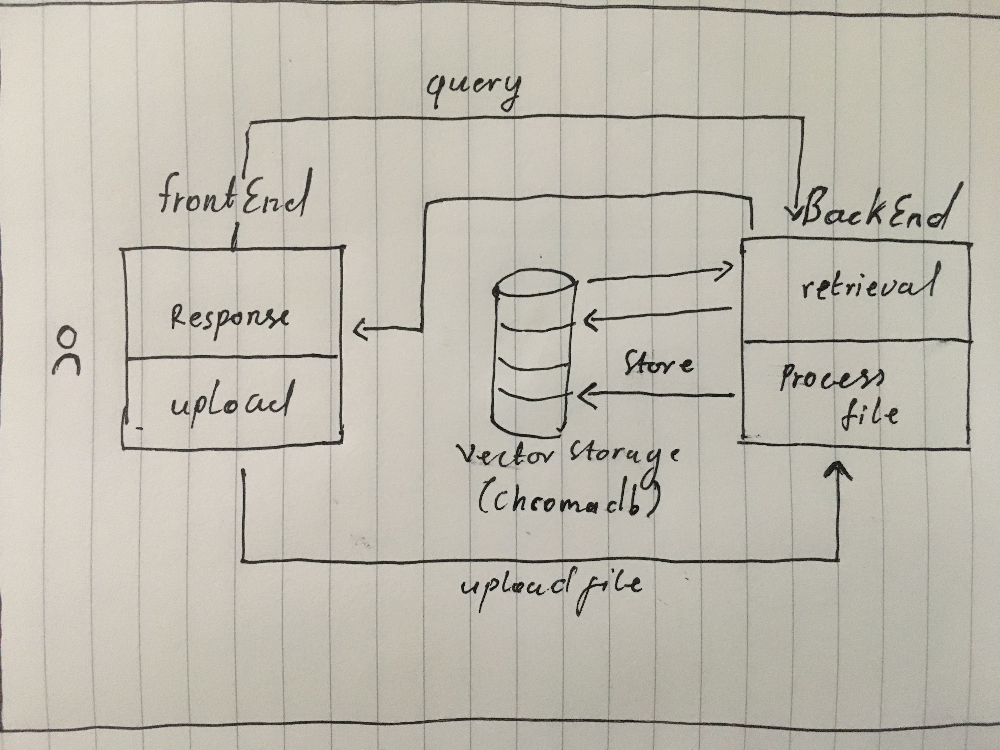

# RGT AI DOCUMENT CHAT ASSIGNMENT


# Description

Base on the requirements This project is a full-stack web application that leverages FastAPI, LangChain with OpenAI models for natural language processing, and a responsive front-end built with Next.js. It's designed to process and understand content from various document formats and interact with users through an AI-powered conversational interface.

# Features

* **Document Processing**: Supports uploading and processing of PDF, CSV, and text files.
* **AI-Powered Conversations**: Utilizes LangChain with OpenAI models to answer questions based on the content of uploaded documents.
* **Interactive Front-End**: Built with Next.js, offering a user-friendly interface for file uploads and real-time AI interactions

# Requirements

* Python 3.x
* Node.js and npm
* FastAPI
* LangChain and OpenAI API key
* Next.js
* OpenAI API
* Langchain
* pydantic
* ChromaDb

# Installation & Setup

### Backend

Set up a Python virtual environment**:

```python
cd Backend
python -m venv venv
source venv/bin/activate  # On Windows, use venv\Scripts\activate
```

**Install Python dependencies**:

```
pip install fastapi uvicorn PyPDF2 python-multipart lanchain openai chroma

```

**Set environment variables**: i have organized this in a folder called Config

```
from dotenv import load_dotenv
import os
from langchain.embeddings import OpenAIEmbeddings
from langchain.llms import OpenAI

load_dotenv()  

OPENAI_API_KEY = os.getenv('OPENAI_API_KEY')
FILE_DIR='./VectorStore/'
PERSIST_DIRECTORY = f'{FILE_DIR}'
CHUNK_SIZE = 550
CHUNK_OVERLAP = 15
TEMPERATURE = 0.8
MAX_TOKENS = 200

llm = OpenAI(
    api_key=OPENAI_API_KEY,
    max_tokens=MAX_TOKENS,
    temperature=TEMPERATURE,
)
embeddings = OpenAIEmbeddings(
    api_key=OPENAI_API_KEY,
)
```

**Run the FastAPI server**:

```
uvicorn main:app --reload
```

### Frontend

**avigate to the frontend directory** and install dependencies:

```
cd frontend
npm install
or 
yarn add

```

**Run the Next.js development server**:

```
npm run dev
or 
yarn dev

```

## Usage


* **Uploading Documents**: Drag and drop or select a document file (PDF, CSV, or text) to upload.
* **Asking Questions**: Type in your questions related to the document's content in the provided input field.
* **Viewing Responses**: The AI model processes the questions and displays answers based on the document's content.


## Architecture


